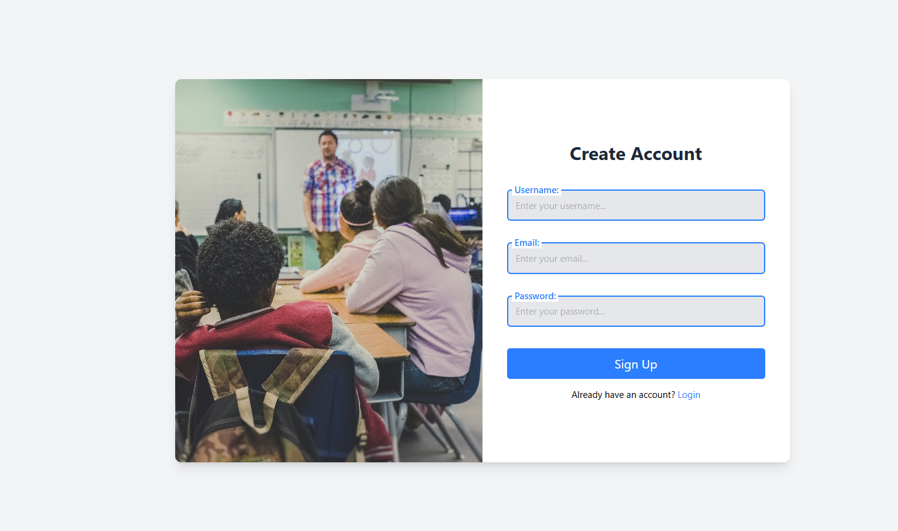
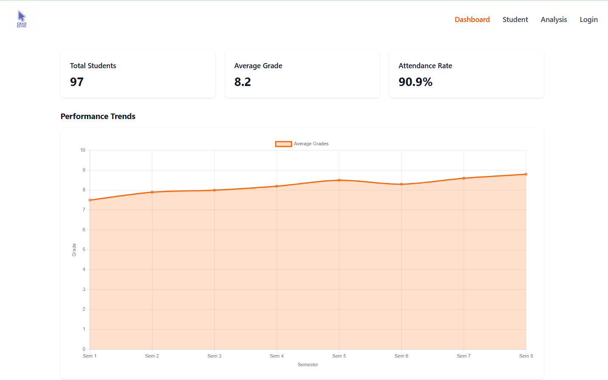
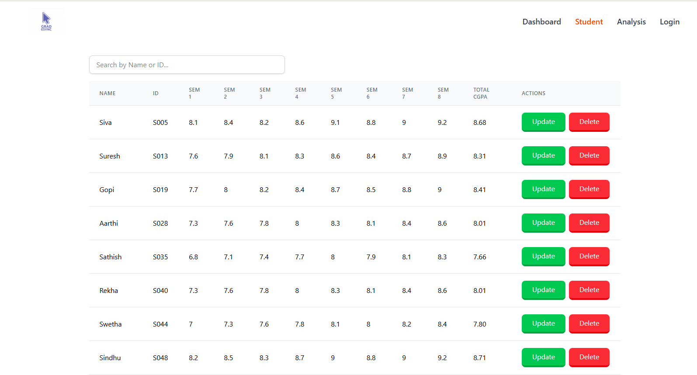
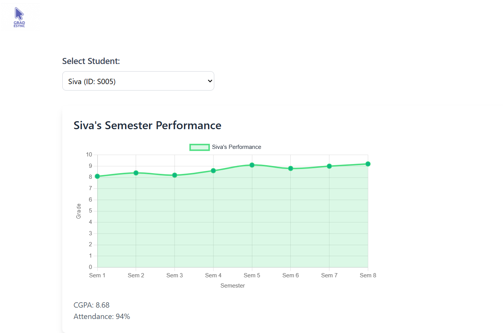

# Student Performance Dashboard

## Project Overview  
This project is a web-based **Student Performance Dashboard** designed to visualize and analyze student academic performance across semesters. It includes a login and signup system, a student data management interface, and an analytics dashboard with interactive charts. The application fetches data from a backend API (`/api/students`) and displays key metrics like CGPA, attendance, and semester-wise grades.

## Key Features  
- **Authentication**: Login and signup pages for secure access  
- **Student Management**: View and manage student records with CGPA, attendance, and grades  
- **Analytics Dashboard**:  
  - Total students, average grade, and attendance rate  
  - Interactive line chart for semester performance  
  - Individual student performance analysis  
- **Responsive Design**: Built with Tailwind CSS  
- **Backend Integration**: Fetches data from `http://localhost:6969/api/students`

## Screenshots  

**1. Login Page**  
  
Users can log in with their email and password. Includes options like "Forgot Password?" and "Create Account".

**2. Signup Page**  
  
Users can sign up with a username, email, and password.

**3. Dashboard**  
  
Displays total students (97), average grade (8.2), attendance rate (90.9%), and a performance chart.

**4. Student Table**  
  
Table with student names, grades, CGPA, attendance, and action buttons.

**5. Analysis Page**  
  
Shows detailed performance of a selected student (e.g., Siva) with CGPA (8.68) and attendance (94%).

> *Note*: Update image paths if hosted externally.

## Technologies Used  
- **Frontend**: React.js, Tailwind CSS  
- **Backend**: Node.js, Express.js  
- **Database**: MongoDB  
- **Charting**: Chart.js

## How It Works  
1. **Login/Signup** for secure access  
2. **Dashboard** displays summary metrics  
3. **Student Table** lists all student records with manage options  
4. **Analysis Page** shows individual student performance

## Installation  

**Step 1:** Clone the repository  
```
git clone <repository-url>
```

**Step 2:** Install dependencies  
```
npm install
```

**Step 3:** Start backend server  
```
node server.js
```

**Step 4:** Start frontend  
```
npm start
```

**Step 5:** Access at  
```
http://localhost:3000
```

## Future Enhancements  
- Admin & Student roles  
- Real-time data updates  
- Predictive performance analysis  
- Mobile app (React Native)  
- Export to CSV/PDF  
- Email alerts for performance  
- Two-factor authentication

## Contributors  
Created and maintained by **Shushanth B S**

## Contact  
For contributions or queries, contact the maintainer (details to be added)

---

© 2025 Student Performance Analytics. Powered by **Shushanth B S**
